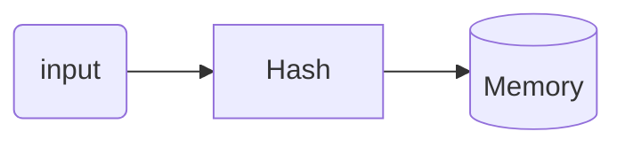

---
cssclasses:
  - wide-page
aliases: 
tags: 
Created: 17-09-2024
Status:
---
# Hash Table
- Constant time $O(1)$
- it is an array with a hash function


#smamplehashFunction
```c
unsigned int hash_funcion(char *name) {
  int length = strlen(name);
  unsigned int hash_value = 0;
  for (int i = 0; i < length; ++i) {
    hash_value += name[i];
    hash_value = (hash_value * name[i]) % TABLE_SIZE;
  }
  return hash_value;
}
```
