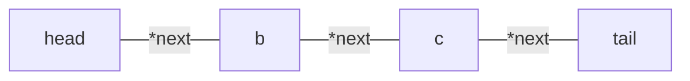

# Linked List

- Elements in a linked list are called nodes
- Every node in the list `point` to the next node in the list.
- last node in the list Contains a `NULL Pointer` to indicate that it is the end of the list(`tail`).
- Linked lists does not allow `random access`

1. [The prime Time](https://youtu.be/cvZArAipOjo?si=q5p_kIs6YK2rgmIy)
   [[Vector]]

- **Single Linked List** : Navigation in forward only.
- **Doubly Linked List** : Forward and backward navigation is possible.
- **Circular Linked List** : Last element is linked to the first element

**Simple Linked list**:



- if `Start` == `NULL` `return` linked list is empty
  #node

```c
struct node{
  int value;
  struct node *next;
}
```

#### Single Linked Lists

- Contatins 2 parts
  - DATA
  - Link
- And together they are called nodes

### Creating a single liked list

Prerequisite: [[Self Referential Structure]]
This [[Self Referential Structure]] will be used to create a node of single linked list

```c
#include <stdbool.h>
#include <stdio.h>
#include <stdlib.h>
#include <string.h>

struct node_t {
  int value;
  // To point to the next node in the list
  struct node_t *next;
};
typedef struct node_t node_t;

void print_the_list(node_t *head) {
  node_t *temperory_ptr = head;
  while (temperory_ptr != NULL) {
    printf("%d - ", temperory_ptr->value);
    temperory_ptr = temperory_ptr->next;
  }
  printf("\n");
}
int main() {
  node_t n1, n2, n3;
  node_t *head;
  n1.value = 10;
  n2.value = 100;
  n3.value = 200;

  // Linking them
  head = &n3;
  n3.next = &n2;
  n2.next = &n1;
  n1.next = NULL; // tail

  print_the_list(head);
  return 0;
}
```

```c
print_nodes((head->next)->next); // we can also access the next element using this style
```

**Linking**:

```c
  // Linking them
  head = &n3;
  n3.next = &n2;
  n2.next = &n1;
  n1.next = NULL; // tail
```

In this example when adding new node say `n4` and if i call the `print_the_list()` with `head` as the actual argument the new node will not print

```c
node_t n4;
n4.value = 10;
n4.next = &n3;
print_the_list(head); // This will not print the n4
```

So in order to `print` the n4 we have to set the latest node `n4` as the head

```c
node_t n4;
n4.value = 10;
n4.next = &n3;
head = &n4;
print_the_list(head); // This will not print the n4
```

Now this will print the following

```bash
11 - 3 - 2 - 1 -
```

Otherwise it would be this

```c
3 - 2 - 1 -
```

**Creating a function to add nodes**:

```c
node_t *create_new_node(int value) {
  node_t *result = malloc(sizeof(node_t));
  result->value = value;
  result->next = NULL;
  return result;
}
```

**Create new Nodes**:

```c
// example creating
  tmp = create_new_node(1);
  head = tmp;
  tmp = create_new_node(2);
  tmp->next = head;
  head = tmp;
  tmp = create_new_node(3);
  tmp->next = head;
  head = tmp;
```

**Automate Creating new Nodes**:

```c
for (int i = 0; i < 25; ++i) {
  tmp = create_new_node(i);
  tmp->next = head;
  head = tmp;
}
```

here

```c
node_t *create_new_node(int value) {
  node_t *result = malloc(sizeof(node_t));
  result->value = value;
  result->next = NULL;
  return result;
}
```

There expanded editon

```c
for (int i = 0; i < 25; ++i) {
  node_t tmp = malloc(sizeof(node_t));
  tmp->value = i ;
  tmp->next = head;
  head = tmp;
}
```

## References

1. Data Structures using C Second Edition , by Reema Thareja
