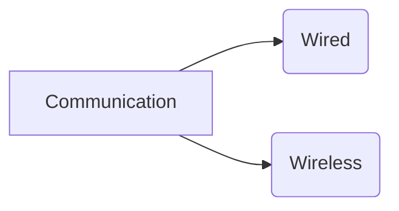

# Communication
_Exchange of information between two or more devices_
- [ ] How it happens
- [ ] what are the types of communication
- [ ] How to improve communication
- [Types](#types)

## Types



- Wired (Copper, Fiber)
- Wireless (Radio, Infrared)
### Wired Communication
In **Wired Communication** physical wires are used as a medium for exchange of informations.
- **Copper Wire**: It is used in LAN cables, telephone lines etc.
- **Fiber Optics**: It is used in high speed internet, long distance communication etc.
### Wireless Communication
>[!Contents]+
>- [[WiFi]]
>- [[Bluetooth LE]]
>- [[Bluetooth]]
>- [[Zigbee]]
>- [[LoRa]]
>- [[NFC]]
>- [[RFID]]
>- [[Z-Wave]]
>- [[Sigfox]]
>- [[NB-IoT]]
>- [[LTE-M]]
>- [[5G]]
>- [[6G]]
>- [[Satellite Communication]]
>- [[Cellular Communication]]
>- [[UWB]]
>- [[Li-Fi]]
>- [[WiMAX]]
>- [[5G NR]]
>- [[4G LTE]]
>- [[3G UMTS]]
>- [[2G GSM]]
>- [[1G]]
>- [[6LoWPAN]]
>- [[Thread]]

In **Wireless Communication** no physical medium is used for exchange of information.
- **Radio**: It is used in FM, AM, TV etc.
- **Infrared**: It is used in remote controls, wireless keyboards etc.

More about [[Wireless Communication]] 
## Communication System


## Modulation Schemes

- [QAM](Communication/Modulation/QAM.md)
- Amplitude Modulation
- Frequency Modulation
- Phase Modulation

### Key Terms

1. BER (Bit Error Rate):Number of _bit errors_ per unit time.

```
if (recieved = 010101010)
and (Transmitted = 111111111)
then error = 3/9 = 5/9
```

```c
#include <stdio.h>
#include <stdbool.h>
float calculate_BER(bool *tranmitted,bool *recieved){
    float error = 0;
    for(int i = 0; i < sizeof(tranmitted); i++){
        if(tranmitted[i] != recieved[i]){
            error++;
        }
    }
    return error/sizeof(tranmitted);
}

int main(){
bool transmitted[] = {1,1,1,1,1,1,1,1,1};
bool recieved[] = {0,1,0,1,0,1,0,1,0};
printf("BER = %f",calculate_BER(transmitted,recieved));
}
```

#### SNR (Signal to Noise Ratio)

- It comparesd the level of desired signal to the level of background noise.
  $$
  \text{SNR} = \frac{P_{signal}}{P_{noise}} \tag{1}
  $$

Signal to Noise Ratio is usually expressed in decibels (dB).

$$
SNR_{dB} = 10 \log_{10}(\text{SNR}) \tag{2}
$$
