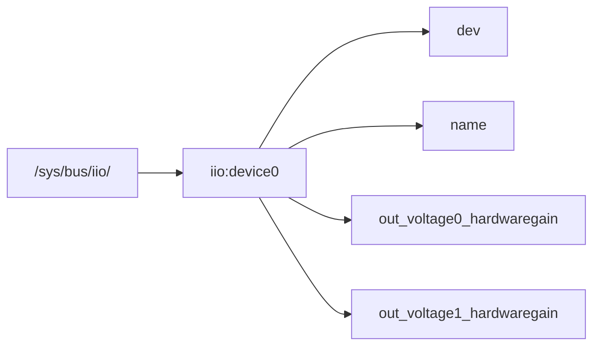

---
cssclasses:
  - wide-page
aliases:
  - pluto sdr
tags: 
Created: 27-09-2024
Status:
---
# Adalm Pluto 
- [[BeamForming Using Adalm Pluto]]
- [ ] What can it do ? 
- [ ] Spcecs 
- [ ] Can it be used in [[Adaptive Gain Adjustment of 5GHz Antenna for Environmental Factor Variation Using Machine Learning]]

## Prerequisites 
prerequisites are the things that need before hand. That is you should know all these things before doing anything in **Adalm Pluto**

- Linux or Windows or MAC With `USB2.0` port or higher which can power at least `500mA` current
- Also need an appropriate antenna for the frequency that you want to work on.
**Softwares**:
1. [IIO Oscilloscope](https://wiki.analog.com/resources/tools-software/linux-software/iio_oscilloscope)
2. [[Matlab Simulink]]
3. [[Communication/SDR/GNU Radio]]


### Pluto Gain Contorl 


**How to control**:
```bash
cd /sys/bus/iio/devices/iio:device0 
cat name # To check name 
echo 6 > out_voltage1_hardwaregain # To set gain
cat out_voltage1_hardwaregain # to check the gain
```

Just initial thought 
1. we can get recived signal power information from [[linssid]]
2. We can use that information and just control the gain of the `adalm pluto` to get the desired signal power. 
3. And check if desired signal power is achieved or not.

- [ ] What is gain control ? 

### IIO 
```bash
iio_info -s # show all the devices
```

- `iio_attr` use full for modifying the attributes of the device on the fly.
