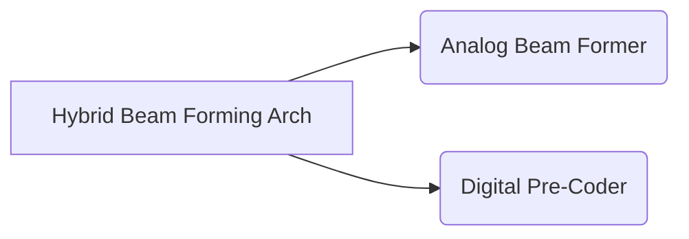

# Building an Antenna
## Types of Antenna 
1. [[#Microstrip Antenna]]
	1. [[#Patch Antenna]]

### Microstrip Antenna 

#### Patch Antenna 
>[!float|right-small] Radiation Pattern -> Patch Antenna 
>

>[!blank|left-small]
>![[patch antenna.excalidraw]]

>

>*Patch antenna is a type of microstrip antenna with low profile which can be mounted on a surface*[^1]

[^1]:https://en.wikipedia.org/wiki/Patch_antenna#:~:text=The%20patch%20antenna%20is%20mainly,it%20on%20printed%20circuit%20boards.

> [!blank|right-medium]
>
> - [[#Parameters We can Change]]
> - [[Building an SDR]]

## Parameters We can Change

1. [[#Beam steering]]

#### Beam Steering

**Beam steering** is a technique for changing the direction of the **main lobe** of a **radiation pattern**

- It can be achieved by ==switching the antenna elements or by changing the relative phases of the RF Signals driving the elements==
- This helps to direct the the transmitted signal to the  receiver.

#### Beam forming

1. Digital beamforming
2. Analog beamforming
   **Digital beamforming** is implemented by matrix multiplications in digital domain and the **Analog Beamforming** is implemented by introducing phase shifts

##### Hybrid Beamforming architecture

Sometimes its called massive **MIMO**

- Enables multi user structure

### Process

calculation of antenna behavior
hybrid beam forming in mmWave frequency bands

RL is an area of ML used to maximize the notion of growing reward
A ML model Support Vector Machine (SVM) was used to design and optimize reflect arrayantennas
feasible beam hopping (BH) in multibeam satellite systems
