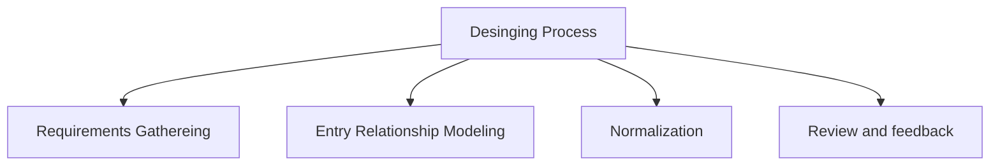

# Assignment 1
Q: **Please write a short note on Data base design**

Ans: 
**Database**: is a collection of structured information/data . Which are controlled by a [database management system (DBMS)](#dbms). The data can be easily `accessed`, `managed`, and `updated`.[^2]
- Most `database` uses [structured query language(SQL)](#sql) for writing to and reading from the `database`.
  
**Database Management System (DBMS)** is a powerful tool for creating and managing large amounts of data efficiently and allowing it to persist over long periods of time,safely[^3].
DBMS Allows The Following:
- Create and specify their  structure of the database 
- Give ability to `query` the data 
- Support storage for very large amount of data
- It also provides `isolation` (Only desired user can access  the data)
- Durability of data 
- Security of data , the list goes on ..

 **SQL(Structured Query Language)** is a programming language used most of the [Relational Database](#relational%20database) which is used for [^2]
1. `Query` 
2. `Manipulate`
3. `define data`
4. `Access Contorl`
 
There are several types of databases are currently available , some of them are 
1. **Relational DATABASE**: Items are organized in tables(rows and columns).
2. **Object-Oriented DATABASE**: Items are organized in objects.
3. **Distributed DATABASE**: Data is stored in multiple locations.
4. **NoSQL databases**: which are any non-relational database 
	1. **Document-oriented databases**
	2. **Key-value databases**
	3. **Wide-column stores**
---

**Data base design** is the process by which designing a database[^1] take place. An efficient data base design is essential because it defines efficiency and performance of the DATABASE . So there are several factors to consider while designing a database. Some of them are:
- To select efficient data structure 
- Future Scalability 
- Integrity 
- Performance and Security 

**How to design a good DATABASE**? 
When it boils down to the bare minimum we all require the database to be fast and reliable we don't want to wait hours for our details to load from the database , in most case the user don't even have a damn clue about if there is a database or not.
And when a site a database is slow or fetching a large they will consider the whole website to be slow . Imagine building a super responsive website which feels like running a 120fps game and the database is so slow that one single one single GET/POST which includes database access makes the whole website feels like its from the 90's.
The setps to design a good database are:
1. Collect and Analyze the requirements: It is the primary step in designing the data base as it collects the requirements of the user and the organization and check what are the type of data they want to store , because high performing database will not help if one can not store anything 
2. Formalize these requirements into **Data Models**
3. Map the conceptual data model to a logical date model.
4. This data model is based upon the data model of the DBMS that will be used for the actual implementation [^4]
5. Finally, a physical data model is the actual implementation of the logical data model for example in `Microsoft` or in `Oracle`.

**Conceptual database design**: 
It is the first step in whole database designing process,which precedes the logical and physical design stages [^5]. In which Identifying the essential data elements , relationships constrains of a model take place. This model serves a blueprint for **logical** and **physical database design** stages 
**Objectives**:
1. Identify the entities and their attributes 
2. Define Relationships 
3. Establish the constrains 

[^5]: https://www.tutorialspoint.com/conceptual-database-design by [Hardik Gupta](https://www.tutorialspoint.com/authors/hardik-gupta-167661135660)

**Logical database design**:
A logical data model is defined in terms of the data model adopted by the DBMS package which will be used for the actual implementation[^4] , Its objective is to create well structured data model that properly reflect the company's business model.

[^4]: PART I : Prof Dr. Bart Baesens "Principles of Database Management" 

**Physical Database Design**:
Which is the process by which the actual implementation of the database take place ie, converting the **logical data model** into a physical model. The physical design of the database specifies the physical configuration of the database on the storage media.
In which the followings happen.
- Defining a set of table structure , data types for fields and constants of these tables(eg: primary key)
- Identifying the specific **storage structures** and **access method** to  retrieve the required data more efficiently 
- Designing Security Features .[^6]

[^1]: A web database is a collection of data that is organized in a way that allows for efficient storage and retrieval.
[^2]: https://www.oracle.com/in/database/what-is-database/
[^3]: Hector Garcia-Molina , Jeffrey D. Ullman , Jennifer Widom "DATABASE SYSTEMS The Complete Book"
[^6]:https://www.sciencedirect.com/topics/computer-science/physical-database-design