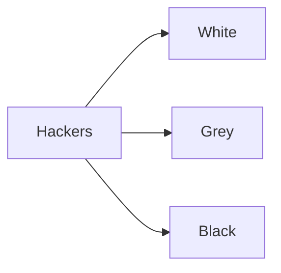

# Cybersecurity

---

## Contents
- [[#Introduction]]
- [[#What is Cybersecurity]]

---

## Introduction

"**Unfortunately, many organizations (as well as individual users) regard security as more of an afterthought**"  -- Red Hat Enterprise Linux 6 Security Guide page-10

---

## Why Exist

- Internet attracted bad people
- It also attracted
  - Criminal gangs
  - Drug Traffickers
  - Human Traffickers , etc ..
- Hackers rob bank by `ransomeware`
- Spying of `Government` pointed by `Edward Snowden` -> by the `National Security Agency(NSA)`
---
#### What it do?
- Protecting systems, network , application from digital attacks
- Finding out vulnerability
- Avoid Accessing Without Permission


---

!Expected Picture]
![[1.presentation1.excalidraw]]


---

### How to implement

- Authentication & Autherization
  - 2FA , MFA
[[4.arch Linux.excalidraw]]
---



---

#### Blue Teaming

- defends against attacks and responds to incidents when they occur
- 


---
#### Red Teaming

**“a group of people authorized and organized to emulate a potential adversary’s attack or exploitation capabilities against an enterprise’s security posture.”**

- plays the role of the attacker
- Attacking side
- simulates and emulating what the bad guys can do
- ***
---
##### How They Perform

- Social Engineering
- Pentesting
- Communication Interception
- Reverse Engineering
- Malware and Obfuscation

---
### Examples 
- [ ] Show Zphisher -> Phishing attack

- [ ] 
#### Salary

[source](https://www.glassdoor.co.in/)

---
#### How to get Started
 


---
#### How to avoid Data get stollen
- Encrypt Everything
```bash
for i in *.* ;do 
gpg -e "$i"
done
```
- to make things simple write a program that encrypts and decrypts
- or set alias 
```bash
alias aliasname='full cmd'
```
###### Tasks
- [ ] remove gpg.conf
- [ ] Show demonstration
- [ ] Set alias to that demonstration
- [ ] restore gpg.conf // automatic 


### Resources
1. Red Hat Enterprise Linux 6 Security Guide
```bash
atril /mnt/STUDY/Books/RedHat/Red_Hat_Enterprise_Linux-6-Security_Guide-en-US.pdf
```

#### Useful Links
- https://defcon.org/ 
- https://google.com
- 