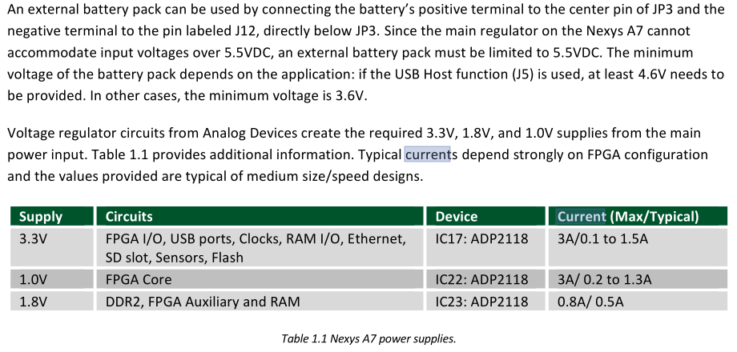

# Side Channel Attack Current Monitor

## Components USed

- Nexys A7

### Nexys A7

**To power fro USB**: Set jumper `JP3` to `USB`
- Out of the box the demo draws ~400ma 
#### Powering the Board 
- External power supply can be used by pluggin into the power jack **(J13)** and setting jumper to `JP3` to **WALL** 
> [!Important] Connection Type
> The supply must be coax , **center-positive**
> - 2.1mm internal diameter 
> - atleast 1A current (5v , 1A = 5W)

#### Powering the board using battery Pack

#### Components Suggestion

##### For Measuring Current

- [[#CJMCU-219 INA219 I2C Bidirectional Current / Power Supply Monitoring Module]]
- [[#Voltage Devider]]

###### CJMCU-219 INA219 I2C Bidirectional Current / Power Supply Monitoring Module

[Source](https://robu.in/product/cjmcu-219-ina219-i2c-interface-no-drift-bi-directional-current-power-monitoring-sensor-module/)

- It supports current , voltage and power

| Spec        | Value     |
| ----------- | --------- |
| $I_max$     | +/- 3.2A  |
| Resolution  | +/- 0.8ma |
| Bus Voltage | 0 - 26V   |
| Interface   | I2C       |

###### Voltage Devider

- Selecting 1k$\ohm$ ohm with series `5v`
