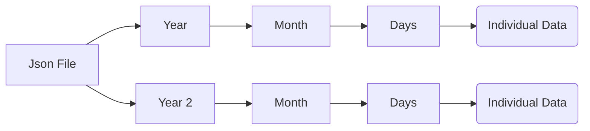

# Smart City Website

Selecting `Flask` for web development

1. [x] Can it plot graphs ✅ 2024-10-04
2. [ ] Can my website scraper can be integrated with this?
3. [ ] How re' going to store the data?

#### Plotting Graphs

#### Database

```bash
pip install flask-sqlalchemy
```

```python
basedir = os.path.abspath(os.path.dirname(__file__))

app = Flask(__name__)
app.config['SQLALCHEMY_DATABASE_URI'] =\
        'sqlite:///' + os.path.join(basedir, 'database.db')
app.config['SQLALCHEMY_TRACK_MODIFICATIONS'] = False

db = SQLAlchemy(app)
```

- construct a path for your SQLite database file. You first define a base directory as the current directory. You use the os.path.abspath() function to get the absolute path of the current file’s directory. The special **file** variable holds the pathname of the current app.py file. You store the absolute path of the base directory in a variable called basedir.
  [Source](https://www.digitalocean.com/community/tutorials/how-to-use-flask-sqlalchemy-to-interact-with-databases-in-a-flask-application)

- Need to check this [URL](https://www.digitalocean.com/community/tutorials/how-to-use-flask-sqlalchemy-to-interact-with-databases-in-a-flask-application)

###### Create the database

```bash
export FLASK_APP=app
flask shell
```

```python
from app import db, Student
db.create_all()
```

###### Storing Data

#### Using Json as Database

- [ ] Check if it can store in high\* order ?


